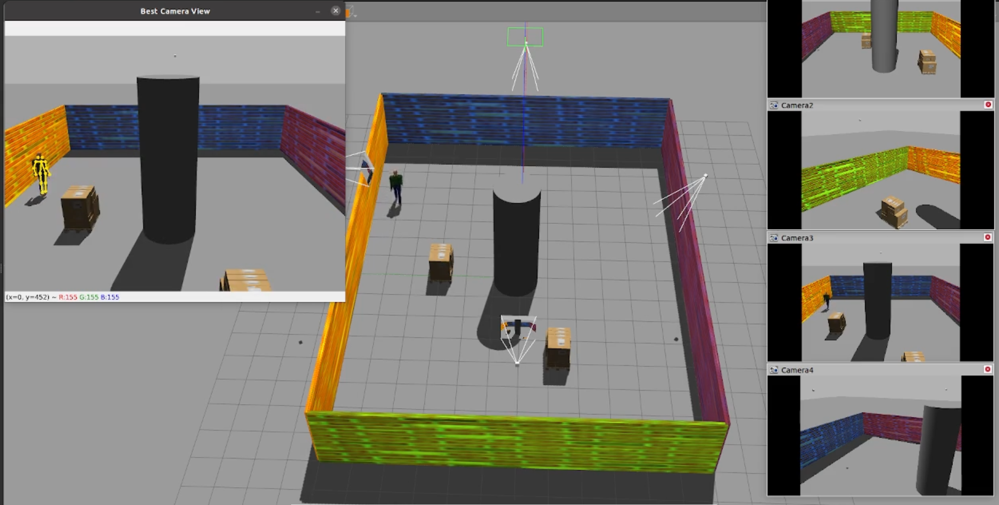

# RoboSAPIENS Active Camera Selection

This repository provides an implementation of an active perception tool in a multi-camera environment. 

## Installation Instructions:

We recommend using a machine with Ubuntu 20.04 (native installation). 
The approach was also tested and verified to work on VMs with GPU passthrough. 
The easiest method is to use an LXD or Incus system container with [xserver forwarding to the host OS](https://blog.simos.info/running-x11-software-in-lxd-containers/).

1. [Install ROS Noetic](http://wiki.ros.org/noetic/Installation/Ubuntu)
- Follow Section 1.1, 1.2, 1.3, 1.4.
- In 1.4 select ``sudo apt install ros-noetic-desktop``
  
2. [Install Gazebo](https://classic.gazebosim.org/tutorials?tut=install_ubuntu)

## Running the tool and the simulator:
To run the simulation and the tool follow the next steps:
1. Enter current directory ``cd active-camera-selection``
2. Run ``./venv_setup.sh ``
3. Run ``activate venv``
4. Run ``cd venv``
5. Run ``source ./bin/activate ``

Before running for the first time you also need to build ROS packages (only needed once):

1. Enter ``cd active-camera-selection``
2. Run `` cd /catkin_ws``
4. Run ``catkin_make``

To launch the project:
1. Run ``source devel/setup.bash``
2. ``roslaunch robosapiens_tool active_camera_selection.launch``

## Examples:

A video showcasing the tool is available [here](https://drive.google.com/file/d/1YyOXba8wrdovWMPNo5imzmLLTzOlbqh3/view?usp=drive_link) or [Demo Video](https://github.com/mthodoris/active-camera-selection/blob/master/demo_video.mp4)

A graphical representation of the ros-nodes is depicted below:

## Acknowledgments

The work presented here is supported by the RoboSAPIENS project funded by the European Commission’s Horizon Europe programme under grant agreement number 101133807. This publication reflects the authors’ views only. The European Commission is not responsible for any use that may be made of the information it contains.

Learn more about [RoboSAPIENS](https://robosapiens-eu.tech/).
 
